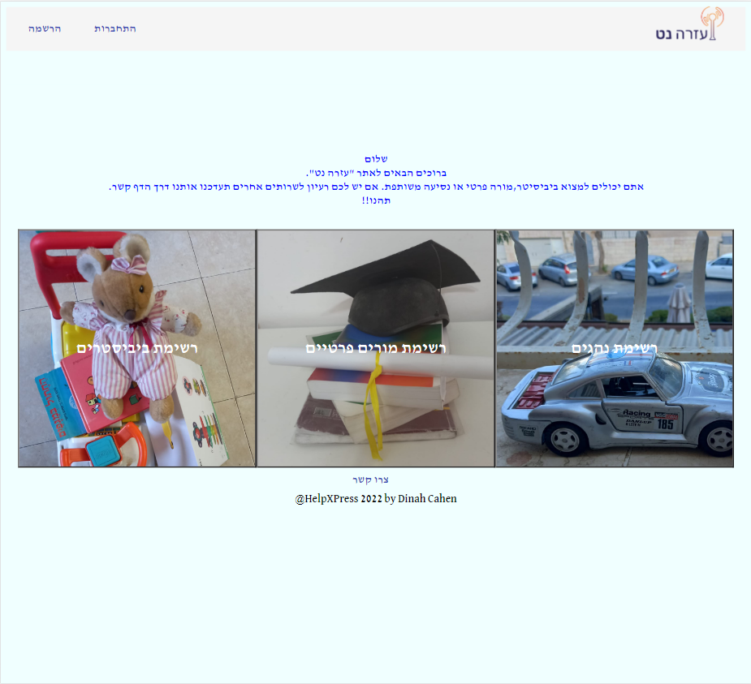

# Angular Project : HelpXPress

## Table of contents
* [Description](#description)
* [Code languages](#code-languages)
* [Frameworks](#frameworks)
* [Database](#database)
* [Some picture from the project](#some-picture-from-the-project)

## Description
The project HelpXPress is designed to give to users the opportunity to offer and search babysitters, teachers and carpools easily and quickly through a single platform.
## Code languages
The project is coded with:
* C#
* TypeScript
* HTML5
* CSS
* SQL Server
## Frameworks
* ASP.NET Core WEB API
* Angular
## Database
* SQL Server
## Some picture from the project
### Home Page

